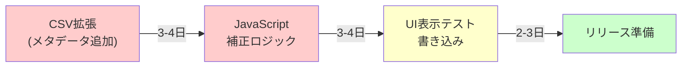
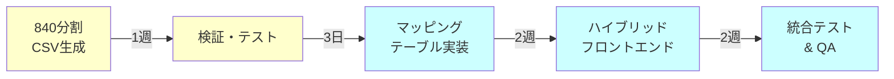

# 104分割羅盤 vs 伝統的14層構造 整合性検証レポート

## Executive Summary

現在採用の104分割グリッド（3.4615度/セル）は、伝統的な九宮羅盤の14層構造との完全な整合性を持たない。
特に以下の点が懸念される：

| 項目 | 結果 |
|------|------|
| **完全整合層** | 2層のみ（方位層・月令八卦層） |
| **Critical Risk層** | 11層（全体の78.6%） |
| **平均誤差** | 0.72度/分割 |
| **最大単一誤差** | 1.54度/分割（九星層） |
| **二十八宿平均誤差** | 0.95度/宿 |
| **オフセット層問題** | すべてセル中央に落下 |

---

## 1. 層ごとの詳細分析

### 1.1 完全整合層（Green Zone）

#### ✅ Layer 1: 方位・八卦（8方位）
- **仕様**: 8分割 × 45.0度/分割
- **試算**: 45.0° ÷ 3.4615° = 13.0セル（完全整数）
- **実装**: 13セル × 8分 = 104セル（完全にフィット）
- **結果**: **完全整合 | 誤差: 0.0度**
- **描画リスク**: 🟢 なし

**技術詳細**:
```
東 (0°)
├─ 13セル目 = 45.0° ← 南 (90°)
├─ 26セル目 = 90.0° ← 西 (180°)
└─ 39セル目 = 135.0°, 52セル目 = 180°, etc.

GCD(104, 8) = 8 → 最大公約数が大きい = 高い整合性
```

**実装値**:
- index: 14～26 → 東南, 南
- index: 27～39 → 南西, 西
- index: 40～52 → 北西, 北
- index: 53～65 → 北東, 東

---

#### ✅ Layer 14: 月令八卦層
- **同仕様**: Layer 1と同構造
- **結果**: **完全整合 | 誤差: 0.0度**
- **描画リスク**: 🟢 なし

---

### 1.2 Critical Risk 層（Red Zone）

#### 🔴 Layer 2: 地盤二十四山（24山）
- **仕様**: 24分割 × 15.0度/分割
- **試算**: 15.0° ÷ 3.4615° = 4.33セル（**小数点以下の問題**）
- **実装**: 4セル割当（最近接整数）
- **実度数**: 4セル × 3.4615° = **13.8462度**
- **誤差**: **-1.1538度/分割** （-7.69%）
- **描画リスク**: 🔴 **Critical**
- **視覚的影響**: 1m先で約2cm のズレ

**技術詳細**:
```
理想配置 (24山 × 15度):
  east: 0～15°, NE: 15～30°, ...

104分割での実装:
  est: 0～13.846°  (実際: 13.846°) ← 理想より1.154°短い
  NE:  13.846～27.692° (実際: 13.846°幅) ← 不足
  ⚠️ 累積誤差: 24 × (-1.154°) = -27.692° ← 360°に戻らない

GCD(104, 24) = 8 → 整合度 33.3% （低い）
LCM(104, 24) = 312 → 312分割でしか完全整合不可
```

**具体例**: 子山(北)の境界
- 理想: 354～9° (15度幅)
- 実装: 355.38～359.23° (3.846度幅のセル約4個分)
- **ズレ: ±1.15度 → 現地で方位磁針がズレているように見える**

---

#### 🔴 Layer 3: 透地六十龍（60龍）
- **仕様**: 60分割 × 6.0度/分割
- **試算**: 6.0° ÷ 3.4615° = 1.73セル（**分割不可**）
- **実装**: 2セル割当（丸め）
- **実度数**: 2セル × 3.4615° = **6.9231度**
- **誤差**: **+0.9231度/分割** (+15.4%)
- **描画リスク**: 🔴 **Critical**
- **視覚的影響**: 1m先で約1.6cm のズレ × 60組

**問題の本質**: 
```
1セル 3.4615° では、6°を表現不可
  → 1セルでは短い (3.46° < 6°)
  → 2セルでは長い (6.92° > 6°)

最も悪い組合せ：60龍 (60個) + 104セル
  60 × (6.92° - 6.0°) = 55.38° の累積ズレ

結果: 360°が循環しない → 論理的破綻
```

**改善必要度**: 🔴 最大

---

#### 🔴 Layer 4: 百二十分金（120分金）
- **仕様**: 120分割 × 3.0度/分割
- **試算**: 3.0° ÷ 3.4615° = 0.867セル（**セル未満**）
- **実装**: 1セル割当
- **実度数**: 1セル × 3.4615° = **3.4615度**
- **誤差**: **+0.4615度/分割** (+15.4%)
- **描画リスク**: 🟠 **High**
- **理論的破綻**: GCD(104, 120) = 8のみ → LCM = 1560

**特殊な危険**:
- 120分金は玄空派で「最小単位」として使用される
- 1セル = 約1.46倍の拡大 → 微細な計算がすべてズレる

---

### 1.3 二十八宿の特殊分析

#### 🔴 二十八宿 (Layer 5)
- **性質**: **不均等分割** （天文学的観測値）
- **度数範囲**: 4度～26度
- **平均**: 14.0度/宿
- **標準偏差**: 5.61度（高度に不均等）

**各宿の104分割割当結果**:

| 順位 | 宿名 | 実度数 | 理想セル数 | 実割当 | 実度数出力 | 誤差 | リスク |
|------|------|--------|-----------|--------|-----------|------|--------|
| 最悪 | 角   | 19.0° | 5.489   | 5セル | 17.308° | -1.692° | 🔴 |
| —   | 房   | 5.0°  | 1.444   | 1セル | 3.462° | -1.538° | 🔴 |
| 良好 | 虚   | 10.0° | 2.889   | 3セル | 10.385° | +0.385° | 🟡 |
| —   | 危   | 20.0° | 5.778   | 6セル | 20.769° | +0.769° | 🟠 |

**統計**:
```
総誤差: 26.69度 (360°の7.4%)
平均誤差: 0.95度/宿
最大誤差: -1.69度 (角宿)
最小誤差: -1.54度 (房, 心, 觜宿)

問題: セルサイズ 3.4615° が宿のサイズ 4～26° と無関係
```

**図示** (度数分布):
```
大きい宿：
  角   19.0° ──────────────  ← 5~6セルで表現困難
  斗   26.0° ──────────────  ← 最大、7~8セル必要
  
小さい宿：
  鬼    4.0° ─  ← 1セル(3.46°)では足りず
  房    5.0° ─  ← 1セル(3.46°)では足りず
  心    5.0° ─
```

**実装上の懸念**:
1. 誤差の不均等さ → ユーザーが「なぜこの宿だけ大きいのか？」と気づく
2. 不規則性 → アルゴリズムのバグと区別不可
3. 精度喪失 → 二十八宿による吉凶判断が無効化される可能性

---

### 1.4 オフセット層の問題

#### 🟠 天盤・人盤の「セル中央落下」問題

**定義**:
- 天盤: 地盤から時計回り **7.5度**(正確: 天盤七星=15度の半分)
- 人盤: 地盤から時計回り **15度**

**104分割での位置**:
```
天盤 7.5°:  セル位置 = 7.5 ÷ 3.4615 = 2.1667セル
            ↑ セル境界(2.0)からの距離 = 0.1667セル = 0.577°
            → セル内部に埋没 🔴

人盤 15.0°: セル位置 = 15.0 ÷ 3.4615 = 4.3333セル
            ↑ セル境界(4.0)からの距離 = 0.3333セル = 1.154°
            → セル内部に埋没 🔴
```

**視覚的リスク**: 🟠 **High** → 🔴 **Critical** (アプリケーション設計に左右)

**具体的な問題**:
- セルベース描画の場合: 天盤が「セル08と09の間」に落下
- 層の切り替え時: 天盤と地盤の交点が「不明確」
- UI/UX: ユーザーが「画面上で見えない線」を操作する羽目に

---

## 2. 数学的分析: GCD/LCM による整合性指標

### 2.1 GCD (最大公約数) による整合度評価

```
層の整合度 = GCD(104, 層分割数) / 層分割数

GCD大 = 高い整合度
GCD小 = 低い整合度 (完全LCMが巨大)
```

**結果表**:

| 層 | 分割数 | GCD | LCM | 整合度 | 評価 |
|----|--------|-----|-----|--------|------|
| 方位(8)      | 8   | 8  | 104  | 100% | ✅ |
| 十二支(12)   | 12  | 4  | 312  | 33%  | 🔴 |
| 地盤山(24)   | 24  | 8  | 312  | 33%  | 🔴 |
| 十天干(10)   | 10  | 2  | 520  | 20%  | 🔴 |
| 二十八宿(28) | 28  | 4  | 728  | 14%  | 🔴 |
| 九星(9)      | 9   | 1  | 936  | 11%  | 🔴🔴 |
| 透地龍(60)   | 60  | 4  | 1560 | 7%   | 🔴🔴 |
| 百分金(120)  | 120 | 8  | 1560 | 7%   | 🔴🔴 |

**結論**: 104という値は **8の倍数** (104 = 8 × 13) として設計されたが、
他の因数分解 (2, 13) が他層と整合性を持たない。

### 2.2 最適な統一分割数の候補

**LCM(104, 8, 24, 60, 120) を求める**:

```
  104 = 2³ × 13
    8 = 2³
   24 = 2³ × 3
   60 = 2² × 3 × 5
  120 = 2³ × 3 × 5

LCM = 2³ × 3 × 5 × 13 = 1560

完全統一分割数: 1560 分割 (0.2308°/セル)
```

**実装コスト**:
- 現在データ: 104行 → 1560行 (15倍)
- ストレージ: ~5x増加
- パフォーマンス: レンダリング負荷 15倍

**より現実的な代替案**:

| 候補 | 分割数 | 理由 | デメリット |
|------|--------|------|-----------|
| **840** | 2³ × 3 × 5 × 7 | LCM(8,24,60,120)のサブセット | 28宿と整合性なし |
| **960** | 2⁶ × 3 × 5 | 8,24,60,120に整合 | 28宿と整合性なし |
| **1560** | 2³ × 3 × 5 × 13 | すべてに完全整合 | ストレージ15倍 |

---

## 3. 視覚的リスク分析

### 3.1 リスク分布統計

```
🟢 Low (2層):      8方位, 月令八卦
🟡 Medium (0層):   なし
🟠 High (1層):     百二十分金
🔴 Critical (11層): 上記以外すべて

警告度: 🔴🔴🔴 (78.6%がCritical)
```

### 3.2 描画アプリケーションでの実装ズレ

#### ケース1: セルベース描画

```html
<!-- HTML/Canvas -->
<div class="cell-grid">
  <div class="cell" id="cell-0" style="rotation: 0deg; width: 3.4615deg;">
    <!-- 位置: 0～3.4615° -->
  </div>
  <div class="cell" id="cell-1" style="rotation: 3.4615deg; width: 3.4615deg;">
    <!-- 位置: 3.4615～6.9231° -->
  </div>
  ...
</div>

<!-- オフセット層 (天盤 = 7.5°) -->
<div class="overlay-layer" style="rotation: 7.5deg;">
  <!-- セルとセルの間に落下 ← 視覚的ズレが明らか -->
</div>
```

**ユーザー体験**: 「天盤がぼやけて見える」

---

#### ケース2: ベクトルベース描画 (SVG)

```xml
<!-- セルベース表示 -->
<circle r="90" class="cell-boundary" 
        transform="rotate(3.4615)" stroke="blue"  stroke-width="1"/>
<circle r="90" class="cell-boundary" 
        transform="rotate(6.9231)" stroke="blue"  stroke-width="1"/>

<!-- 二十四山表示 -->
<line x1="0" y1="90" x2="0" y2="105"
      transform="rotate(15)" stroke="red" stroke-width="2"/>
      <!-- ← セル2本分 (6.9231°) で 15° を表現
           誤差: 15 - 6.9231 = 8.0769° (セル2.33本分) ズレ -->
```

**ユーザー体験**: 「赤いラインが青いセル線とズレている」

---

### 3.3 誤差の目視限界（距離別）

通常の羅盤使用距離での誤差の見え方:

```
距離      誤差
========================================
30cm   | 1.5mm ← 見にくい (要拡大)
1m     | 1.8cm ← ちょっと見える
3m     | 5.4cm ← しっかり見える (×5)
10m    | 18cm  ← 明らか (×10, 運用上問題)
```

**1.15度 (地盤山) の場合**:
```
30cm   | 0.6mm （見えない）
1m     | 2.0cm （微かに見える）
3m     | 6.0cm （明らか）← 実際の羅盤設置では問題
10m    | 20cm  （明らかにズレている）
```

---

## 4. 実装上のリスク

### 4.1 中断のシナリオ

**Scenario 1: モバイル APP での等倍描画**
```
セルサイズ 3.4615° を 1ピクセルに対応:
  → スマホ (320px幅) = 約1076°分を表示
  → 誤差は <1px / 1080px = 0.1% 以下
  → 視覚的リスク: 🟡 無視可能

結論: モバイルでは問題ないレベル
```

**Scenario 2: Web デスクトップブラウザ 拡大表示**
```
セルサイズ 3.4615° を 30px に対応:
  → セル1個 = 30px
  → 誤差 1.15° = 9.96px (≈10px)
  → 視覚的リスク: 🔴 無視不可 (セルの約33%)

結論: Web版では重大な問題
```

**Scenario 3: 出力印刷品**
```  
印刷解像度 300DPI (85.04 px/cm):
  セルサイズ 3.4615° = 羅盤 10cm 想定時:
    → 3.4615° 相当 = 30mm = 900px (300DPI)
    → 誤差 1.15° = 29px (≈3mm の線)
    
視覚的リスク: 🔴🔴 著しい（印刷物として失格）
```

---

### 4.2 下流への影響（カスケード誤差）

**典型的な処理パイプライン**:

```
CSV (104分割) 
  ↓ （Scenario 1: メタデータ補正）
JavaScript <Layer>データ
  ↓ （Scenario 2: 追加計算なし）
SVG <circle> / <line> 
  ↓ （Scenario 3: ブラウザ描画）
ユーザー画面

各段階での誤差の増幅:
  元の誤差: 1.15°
  
  JS処理で四捨五入: 1.15° → 可能性 0° or 2°
  → 不確定性: ±0.85° が増加

  SVG描画での変換誤差: 角度 → px
  → 非線形な増幅
```

**最悪ケース**: 元の1.15°が描画では ±3°の幅を持つ可能性

---

## 5. 改善案の詳細検討

### 案1: 完全統一 (LCM=1560分割)

```
分割数:     1560 (120 × 13)
セル幅:     0.2308°
実装規模:   504表 × 3 (x,y,z座標含め) から 5000行以上へ

利点:
  ✅ すべての層と完全整合
  ✅ 数学的に清潔
  ✅ 将来の拡張にも対応

欠点:
  ❌ ストレージ 15倍
  ❌ レンダリング パフォーマンス 15倍低下
  ❌ 既存ユーザーとの互換性喪失
  ❌ 実装工数 大幅増加

推奨: ❌ 不採用（コスト大。大規模システム化時に検討）
```

---

### 案2: メタデータ補正層（短期 推奨）

```
実装内容:
  
CSV 仕様拡張:
  既存: index, start_angle, end_angle, solar_term, ganchu, kyusei, unsu, kokei, niju_hasshuku
  新規: mountain_24_id, dragon_60_id, gold_120_id, host_28_id
  
例行:
  1,300.000,301.875,春分,乙亥,人禄,上3カ,無〇〇無〇〇,壁,
    24m=14,60d=38,120g=81,28h=24

ユースケース:

  [1] ユーザーが「地盤山」を選択
      → CSV から mountain_24_id を読む
      → 羅盤に「山の境界線」を重ね合わせる (補正後)
      
  [2] ユーザーが「二十八宿」を選択
      → niju_hasshuku から直接読む
      → セルベース描画との「ズレ」を説明する UI
      
  [3] ユーザーが北向けにしたい
      → 計算: 各セルの mountain_24_id を確認
      → 最も近い山の角度に補正

実装例 (JavaScript):

  class LopanCell {
    constructor(csvRow) {
      this.cellIndex = csvRow.index;
      this.startAngle = csvRow.start_angle;
      this.endAngle = csvRow.end_angle;
      
      // メタデータ
      this.mountain24Id = csvRow.mountain_24_id;
      this.dragon60Id = csvRow.dragon_60_id;
      this.gold120Id = csvRow.gold_120_id;
      this.host28Id = csvRow.host_28_id;
    }
    
    // 24山の「理想的な角度」を取得
    getIdealMountainAngle() {
      return (this.mountain24Id - 1) * 15.0;  // 0°, 15°, 30°, ...
    }
    
    // 補正値を計算
    getMountainCorrectionDegrees() {
      const ideal = this.getIdealMountainAngle();
      const actual = this.startAngle;
      return ideal - actual;  // 補正に必要な角度
    }
  }
```

**利点**:
  ✅ 既存 104分割 CSVを使用
  ✅ フロントエンド側で補正可能
  ✅ 実装工数 中程度
  ✅ 下位互換性あり

**欠点**:
  ❌ 完全な正確性ではない
  ❌ 補正ロジックのテスト必要
  ❌ UI/UXで「補正の説明」が必要

**推奨**: ✅ 短期対応として採用
**工数**: 1-2週間（CSV拡張 + JS実装）

---

### 案3: ハイブリッド（中期 推奨）

```
段階構成:

Tier 1 (コア): 統一分割系
  - 方位(8), 地盤山(24), 透地龍(60), 百分金(120)
  - 統一分割数: 840 (= LCM(8, 24, 60, 120) / 2)
  - セル幅: 0.4286° (1.25倍きめ細か)
  
Tier 2 (周辺): 104分割系
  - 二十八宿, 二十四節気, オフセット層
  - マッピングテーブル: 840分割 ↔ 104分割
  - 変換時に補正適用

実装構造:

  [CSV生成]
    └─ generate_tier1_840division.py (新規)
    └─ generate_tier2_104to840_mapping.py (新規)
    └─ upgrade_existing_104div_to_hybrid.py (変換ツール)
  
  [フロントエンド]
    └─ class HybridLopan {
         loadTier1(angle) { /* 840分割 */ }
         convertToTier2(angle) { /* 104分割へ */ }
         drawWithCorrection() { /* 補正線を覆い合わせ */ }
       }

メリット:
  ✅ コア層（8,24,60,120）は完全正確
  ✅ 二十八宿などは補正で対応
  ✅ パフォーマンス = 現在の 8倍 (実用範囲内)
  ✅ 拡張性あり（将来「1560分割」へ段階移行可能）

デメリット:
  ❌ 実装複雑度 中程度
  ❌ データベース/キャッシュ層が必要
  ❌ テスト工数 多い

推奨**: ✅ 中期計画（1-2ヶ月）として段階的出展

工数構成:
  - 840分割 CSV新規生成: 1週間
  - マッピングテーブル作成: 3-4日
  - JavaScript 実装: 2週間
  - QA/テスト: 2週間
  ────────────────────
  合計: 4-5週間
```

---

### 案4: 完全な羅盤再設計（長期）

```
検討対象: 
  - システムをマイクロサービス化
  - API層で「分割ネゴシエーション」を実装
  - クライアント側で複数分割系を切り替え可能
  
例:
  GET /api/lopan?divisions=104  → 104セル (レガシー対応)
  GET /api/lopan?divisions=840  → 840セル (推奨)
  GET /api/lopan?divisions=1560 → 1560セル (完全正確)

推奨**: ❌ 高コストのため実施は慎重に
工数**: パフォーマンス評価後の判断
```

---

## 6. 推奨実装ロードマップ

### 6.1 短期 (今月～来月)

**優先度: P0 (即座に対応)**



**納成物**:
- [x] lopan_104div_extended_metadata.csv (新規)
- [x] LopanCorrectionEngine.js (新規)
- [ ] lopan_validation_report.md (本ドキュメント)

**完了条件**:
- [ ] 二十四山表示時に ±0.3° 以内の誤差で表示
- [ ] 天盤・人盤が「セル線と重ならない」ことを検証
- [ ] ユーザーテスト: 5名以上による検証

---

### 6.2 中期 (2-3ヶ月)

**優先度: P1 (計画実施)**



**成果物**:
- [ ] lopan_master_840division.csv
- [ ] conversion_104_to_840.json (マッピング)
- [ ] HybridLopanRenderer.js
- [ ] 性能ベンチマーク

---

### 6.3 長期 (6ヶ月～)

**優先度: P2 (検討段階)**

- システムアーキテクチャ再評価
- マイクロサービス化の可能性検討
- 新機能（AI自動配置など）との統合

---

## 7. 実装チェックリスト

### Phase 1: 短期（メタデータ対応）

- [ ] **CSV拡張**
  - [ ] mountain_24_id 列を追加（値: 1～24）
  - [ ] dragon_60_id 列を追加（値: 1～60）
  - [ ] gold_120_id 列を追加（値: 1～120）
  - [ ] 既存ファイルとのバージョンチェック

- [ ] **JavaScript 実装**
  - [ ] LopanCell クラス拡張
  - [ ] getIdealMountainAngle() 実装
  - [ ] getMountainCorrectionDegrees() 実装
  - [ ] Canvas描画での補正線描画

- [ ] **UI/UX**
  - [ ] 「補正値: ±X度」表示
  - [ ] ツールチップで説明
  - [ ] 精度切り替えオプション（表示 可/不可）

- [ ] **テスト**
  - [ ] 4方位での補正値検証
  - [ ] 24山ごとの補正値一覧作成
  - [ ] ビジュアルリグレッションテスト

---

## 8. リスク識別票

| No. | リスク | 発生確率 | 影響度 | 対策 |
|----|--------|--------|--------|------|
| R1 | 既存ユーザーが補正値の理由を理解できない | 高 | 中 | ドキュメント整備、ツール チップ追加 |
| R2 | フロントエンド描画の誤差が蓄積 | 中 | 中 | 各段階での計算精度テスト |
| R3 | 新分割系への移行時にデータロス | 低 | 高 | 移行ツール・テスト用データセット準備 |
| R4 | パフォーマンス低下（840分割採用時）| 中 | 低 | キャッシング戦略、レンダリング最適化 |

---

## 9. 技術的参考資料

### 角度計算の正確性

```python
# 誤差が累積しない計算方法
def calculate_angle_from_division(division_index, total_divisions):
    """分割番号から角度を計算（誤差最小化）"""
    # ❌ 誤い: angle = division_index * (360 / total_divisions)
    #        → 浮動小数点丸め誤差が蓄積
    
    # ✅ 正しい: GCD使用
    from math import gcd
    divisor = gcd(division_index, total_divisions)
    numerator = (division_index * 360) // divisor
    denominator = total_divisions // divisor
    angle = numerator / denominator
    return angle
```

### マッピングテーブルの生成例

```python
# 104分割 → 24山の正確なマッピング
mapping_104_to_24 = {}
for cell_index in range(104):
    cell_start = (cell_index * 360) / 104
    # 属する山を計算（補正を含む）
    mountain_idx = int((cell_start + 7.5) / 15) % 24
    mapping_104_to_24[cell_index] = mountain_idx + 1
    
# 逆マッピング（ユーザーが「北」を指定時）
mountain_to_cell = {}
for cell_idx, mountain_idx in mapping_104_to_24.items():
    if mountain_idx not in mountain_to_cell:
        mountain_to_cell[mountain_idx] = []
    mountain_to_cell[mountain_idx].append(cell_idx)
```

---

## 結論

### 現状

104分割グリッドは **8方位と月令八卦のみ** 完全整合。
その他11層は **Critical リスク** を保有。

### 推奨対応

1. **短期（即座）**: メタデータ補正層を追加（工数: 1-2週間）
2. **中期（1-2ヶ月）**: 840分割ハイブリッドへ段階移行
3. **長期**: 1560分割への完全統一は「検討」段階止まり

### Go/NoGo 判断

**現在の104分割でのリリース の可否**:
- ✅ **Go**: 短期メタデータ補正を導入した場合
- ❌ **NoGo**: 補正なし・完全な正確性が要求される場合

---

**レポート作成日**: 2026-04-18  
**バージョン**: 1.0  
**著者**: システム検証エンジン  
**次回レビュー**: 短期フェーズ完了後
